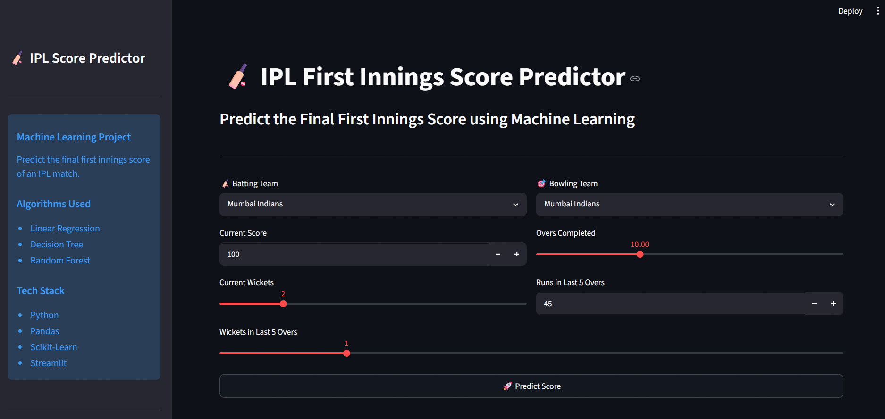
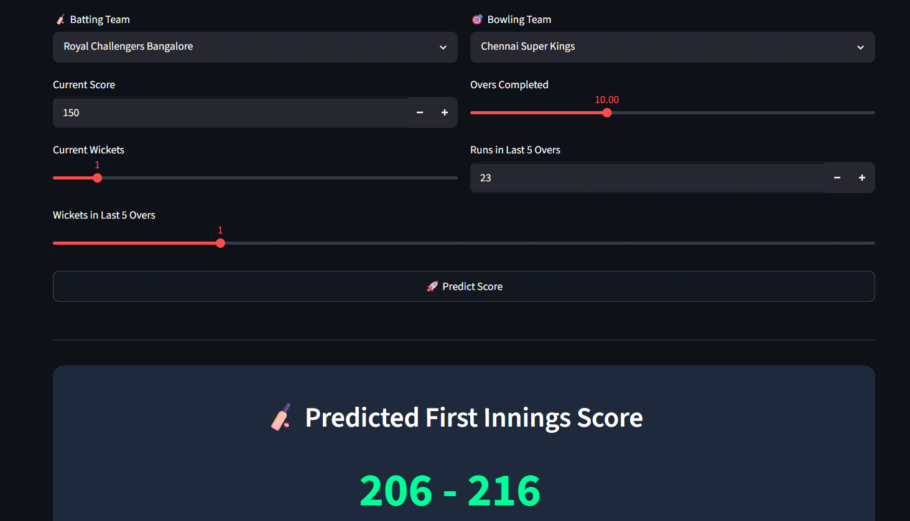

# 🏏 IPL First Innings Score Predictor

Predict the final first innings score of an IPL match using Machine Learning and Streamlit.

---

## 🚀 Features

- Interactive Streamlit Web App
- Predicts final first innings score
- Machine Learning based prediction
- Clean and simple UI
- Real-time score prediction
- Feature Engineering pipeline
- Model saved using Joblib

---

## 🛠 Tech Stack

- Python
- Pandas
- NumPy
- Scikit-Learn
- Streamlit
- Joblib

---

## 📂 Project Structure

```
ML-IPL
│
├── data
├── models
├── outputs
├── scripts
├── app.py
├── requirements.txt
└── README.md
```

---

## 📊 Dataset

The project uses two IPL datasets.

- matches.csv
- deliveries.csv

Historical IPL matches from 2008–2019 were used to train the prediction model.

---

## ⚙️ Feature Engineering

The following features are used for prediction:

- Batting Team
- Bowling Team
- Current Score
- Current Wickets
- Overs Completed
- Current Run Rate
- Runs in Last 5 Overs
- Wickets in Last 5 Overs

---

## 🤖 Machine Learning Models

The following algorithms were trained and compared:

- Linear Regression
- Decision Tree Regressor
- Random Forest Regressor

The best-performing model was saved as:

```
models/best_model.pkl
```

---

## 📈 Model Performance

| Model | MAE | RMSE |
|------|------:|------:|
| Linear Regression | 13.42 | 18.01 |
| Decision Tree | 3.44 | 11.01 |
| Random Forest | 7.53 | 10.90 |

---

## 🖥 Application

### Home Page



---

### Prediction



---

## ▶️ Run Locally

Clone the repository

```bash
git clone https://github.com/Rohittt619/ML-IPL.git
```

Go inside project

```bash
cd ML-IPL
```

Install dependencies

```bash
pip install -r requirements.txt
```

Run the Streamlit app

```bash
streamlit run app.py
```

---

## 📌 Future Improvements

- XGBoost Model
- Hyperparameter Tuning
- Deployment on Streamlit Cloud
- Docker Support
- Azure Deployment

---

## 👨‍💻 Author

**Rohit Rathod**

GitHub:
https://github.com/Rohittt619

LinkedIn:
https://linkedin.com/in/rohit-rathod-19442a228
